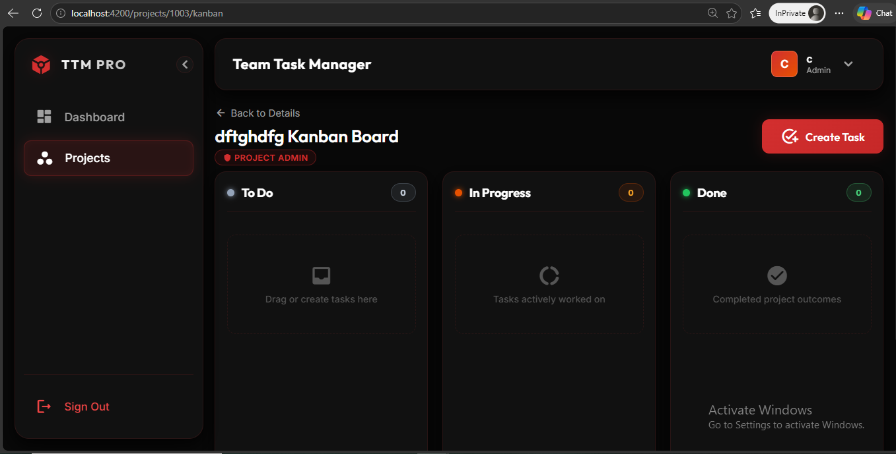
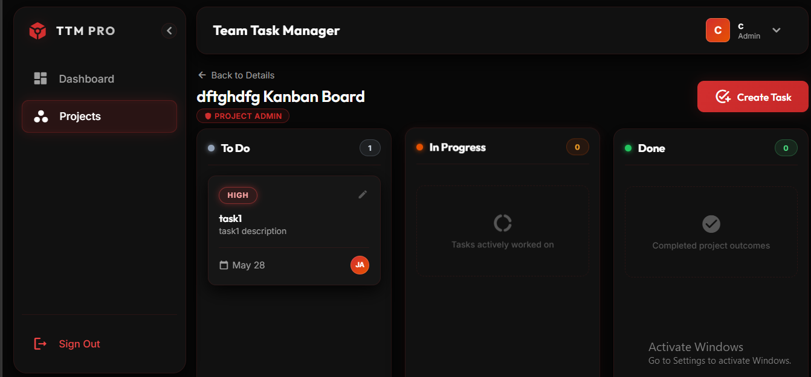
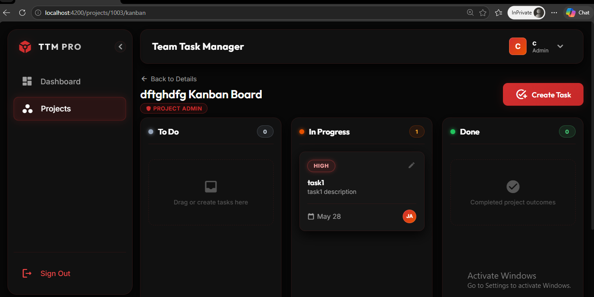

# Team Task Manager (TTM PRO)

An elite, collaborative enterprise-grade **Team Task Manager (TTM PRO)** designed for modern, high-velocity software engineering squads. Inspired by premium SaaS architectures like Trello and Asana, TTM PRO features a clean .NET 8 Web API architecture, an optimized SQL Server database configuration, and a high-performance **Angular 21 Standalone** client utilizing reactive state management and fluent drag-and-drop workflows.

---

## 🎨 Immersive Design Theme: "Fiery Red"

The application establishes a premium, state-of-the-art dark obsidian user experience meticulously styled to wow users at first glance:
*   **Obsidian Deep Bases**: Rich, harmonious dark canvases (`#0D0D0D`, `#161616`, `#1A1A1A`) that eliminate eye strain.
*   **Volcanic Crimson Accents**: Vibrant glowing outlines, active status indicators, and sleek warning states (`#FF3333`, `#FF4D4D`).
*   **Glassmorphic Card Systems**: Translucent high-end panels featuring harmonious gradient backdrops, smooth micro-animations, and responsive border-glow transformations.

---

## 🖼️ Visual Showcase

Experience the luxury "Fiery Red" design language in action across our primary user interfaces:

### 1. Core Dashboard Interface
Real-time KPI analytic computation counters, dynamic overdue alert panels, and status dispersion profiles.


### 2. Collaborative Kanban Board View
Optimistic drag-and-drop lifecycle transitions, fluid status columns, and dynamic role-based action boundaries.


### 3. Granular Task Management & Global Assignee Engine
Dynamic task creation, validation guards, and our global user discovery assignee registry.


---

## 🚀 Key Features

*   **Global User Discovery Network**: Replaced gated project-member assignee scopes with a global lookup engine. Tasks can now be seamlessly discovered and assigned to any registered database profile.
*   **Full-Stack Drag-and-Drop Lifecycle**: Fully integrated Angular CDK drag-and-drop mechanics mapped to optimistic UI state updates and synchronized with backend API persistence.
*   **Real-Time KPI Analytical Counters**: High-performance SQL group aggregation and client-side Signal evaluation to compute task status distribution, priority weights, and overdue metrics instantly.
*   **Role-Based Deletion Safeguards**: Granular authorization policies that permit only project creators or administrators (users designated with "Admin" roles) to purge completed tasks.
*   **Secure Authentication & Claims Flow**: Secure BCrypt-based password hashing, JWT Bearer Token validation, and automatic frontend interceptors.

---

## 🛠️ Technology Stack Grid

| Layer | Technologies & Libraries | Key Purposes |
| :--- | :--- | :--- |
| **Frontend** | Angular 21 (Standalone), Angular Signals, RxJS, Angular CDK Drag & Drop, SCSS | High-performance client, reactive state management, fluid animations, and glassmorphic aesthetics |
| **Backend** | .NET 8 Web API, Entity Framework Core 8, JWT Bearer Token Security | Clean RESTful API, compiled SQL mapping, secure identity claims, and custom global exception middlewares |
| **Database** | MS SQL Server / LocalDB | Transaction-safe storage, composite keys, non-clustered performance indexes, and pre-seeded developmental schemas |
| **Security** | BCrypt.Net-Next, System.Text.Json | Multi-round password salting and optimized circular JSON object reference serializations |

---

## 📂 Repository Structure

```text
/backend          # ASP.NET Core Web API (Controllers, DTOs, DbContext, Services)
/frontend         # Angular 21 Standalone SPA (Signals, Interceptors, CDK Drag-Drop)
/infra            # Production-grade DDL SQL schema creation, indexes, and seed datasets
/screenshots      # Dynamic product screenshots for visual showcase
/README.md        # Comprehensive enterprise application documentation
```

---

## 💻 Local Development Guide

Follow this step-by-step guide to launch the entire ecosystem locally on your developer workstation.

### Prerequisites
*   **.NET 8.0 SDK** (LTS)
*   **Node.js (v18+ or v20+)** & **NPM**
*   **Microsoft SQL Server** (LocalDB, Express, Developer, or Enterprise Edition)

---

### Step 1: Database Initialization & Seeding

The database setup uses a transaction-safe script `infra/schema.sql` that configures tables, cascade deletes, indexing, and seeds testing credentials.

1.  Open **SQL Server Management Studio (SSMS)** or your preferred SQL editor and connect to your SQL Server instance (e.g. `(localdb)\mssqllocaldb` or `localhost`).
2.  Open [infra/schema.sql](file:///f:/Coding/TeamTaskManager/infra/schema.sql) and execute the entire script to create and seed the `TeamTaskManagerDb` database.
3.  Alternatively, execute via the command line:
    ```bash
    sqlcmd -S (localdb)\mssqllocaldb -i infra/schema.sql
    ```

---

### Step 2: Backend API Bootstrapping

1.  Navigate to the `/backend` directory:
    ```bash
    cd backend
    ```
2.  Configure your database connection string in `appsettings.Development.json` (if your SQL Server instance differs from the default `(localdb)\mssqllocaldb`):
    ```json
    "ConnectionStrings": {
      "DefaultConnection": "Server=YOUR_SERVER_NAME;Database=TeamTaskManagerDb;Trusted_Connection=True;MultipleActiveResultSets=true;TrustServerCertificate=True"
    }
    ```
3.  Restore, build, and run the API:
    ```bash
    dotnet restore
    dotnet run --launch-profile http
    ```
4.  The API will serve locally at: `http://localhost:5000`. You can explore the interactive API schema at `http://localhost:5000/swagger`.

---

### Step 3: Frontend Client Bootstrapping

1.  Navigate to the `/frontend` directory:
    ```bash
    cd frontend
    ```
2.  Install all node dependencies:
    ```bash
    npm install
    ```
3.  Launch the hot-reloading development server:
    ```bash
    npm start
    ```
4.  The application compiles and launches automatically in your browser at: `http://localhost:4200`.

---

## 🔐 Credentials for Immediate Testing (Pre-seeded)

Log in to the client interface using these pre-seeded development identities:

*   **Administrator Context (Full project admin & delete rights)**:
    *   **Email**: `admin@taskmanager.com`
    *   **Password**: `Password123!`
*   **Developer Context (Standard team member & creation rights)**:
    *   **Email**: `jane@taskmanager.com`
    *   **Password**: `Password123!`

---

## 📦 Production Deployment Specifications

TTM PRO is designed for rapid containerization and instant, production-ready deployments on cloud services like **Railway** or **Render**.

### Backend Production Configuration
The backend initialization pipeline ([Program.cs](file:///f:/Coding/TeamTaskManager/backend/Program.cs)) extracts dynamic environmental variables injected by cloud routers, bypassing local configuration files:

1.  **Database Connection Routing (`DATABASE_URL`)**: 
    The API prioritizes the `DATABASE_URL` environment variable first. It falls back to `appsettings.json` connection strings only if the variable is null or empty.
2.  **Kestrel Port Binding (`PORT`)**:
    Kestrel binds dynamically to any incoming network adapter using the port assigned by the cloud platform environment variable, ensuring robust container load balancing:
    ```csharp
    var port = Environment.GetEnvironmentVariable("PORT") ?? "5000";
    builder.WebHost.ConfigureKestrel(options =>
    {
        options.ListenAnyIP(int.Parse(port));
    });
    ```

### Required Deployment Environment Variables
When deploying the system to production, configure the following environment variables in your cloud dashboard:

| Variable Name | Example Value | Purpose |
| :--- | :--- | :--- |
| `DATABASE_URL` | `Server=tcp:sqlserver.railway.internal;Database=prod;User Id=sa;Password=...;` | Primary SQL Server connection string for production storage |
| `PORT` | `8080` (Assigned by cloud host) | The external port mapped by the container load-balancer |
| `JWT_SECRET` | `YOUR_SUPER_SECURE_512_BIT_PRODUCTION_KEY_TOKEN_HERE_!!!` | Overrides the development JWT signing key for military-grade authorization security |
| `ASPNETCORE_ENVIRONMENT` | `Production` | Disables debug screens, mounts production exception middleware, and closes Swagger UI gates |

---

## 🔧 Maintenance, Diagnostics & CORS Rules

*   **CORS Gating**: The backend is configured to allow origins dynamically. If you deploy the frontend and backend on distinct domains (e.g., `https://my-task-app.vercel.app` and `https://api.railway.app`), ensure you add the frontend host URL to the Cors Policy inside `backend/Program.cs` or override it via standard proxy headers.
*   **SSL/TLS Certificates**: On LocalDB development, the connection string contains `TrustServerCertificate=True`. For strict production SQL Server databases, ensure a trusted SSL handshake is verified by disabling trust overrides and supplying a valid CA bundle.
*   **CDK Drag & Drop Lag Diagnostics**: The Kanban Board applies immediate optimistic updates. If the server fails to update task status in the database (e.g. database network timeouts), the client automatically rolls back the card to its original swimlane and displays a non-intrusive volcanic toast notification.
